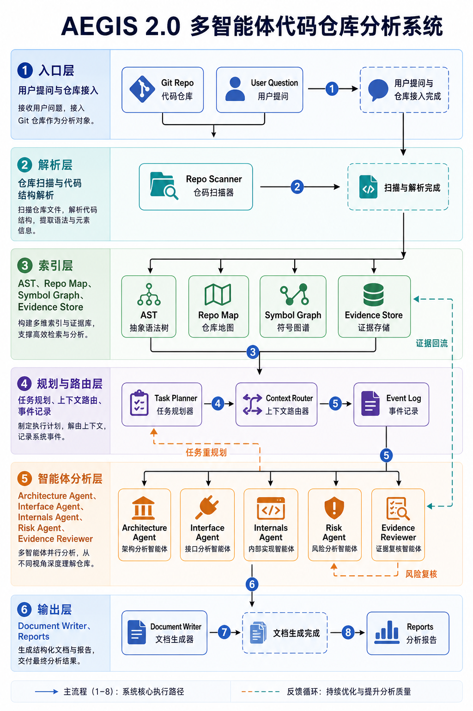

# AEGIS 2.0: Multi-Agent Code Repository Analyst

AEGIS 是一个为 **火山杯智能体大赛** 准备的代码仓库阅读分析系统。它把一个软件仓库转化为可检索、可引用、可审查的结构化知识，再由多个专项 Agent 生成架构、接口、内部实现、数据状态、运行配置和风险报告。

> Automated Exploration & Guided Intelligence for Software.



## Highlights

- **Repository Knowledge Layer**: Repo Map、符号表、依赖图、调用图、接口目录、Evidence Store。
- **CodeGraph**: 统一的代码图谱节点/边模型，支持接口链路追踪和变更影响分析。
- **RAG for Agents**: 从 CodeGraph、文件、接口、符号和证据生成检索索引，支持仓库问答。
- **Multi-Agent Workflow**: Architecture、Interface、Internals、Data State、Build Runtime、Risk、Evidence Reviewer。
- **Evidence-First Reports**: 每条重要结论尽量携带文件路径、行号、代码片段和置信度。
- **Incremental Cache**: 文件 hash 未变时复用解析结果，适合重复分析和 Git Diff 场景。
- **Optional LLM Agent**: 默认离线可用；配置 OpenAI 兼容文本接口后启用 LLM 综合分析。
- **Readable Outputs**: Markdown、HTML、Mermaid、JSON 知识层和事件日志。

## Quick Start

```powershell
python main.py examples\sample_repo
```

也可以安装成本地 CLI 后使用：

```powershell
python -m pip install -e .
aegis examples\sample_repo
```

先做本地环境自检：

```powershell
python main.py examples\sample_repo --doctor
python main.py examples\sample_repo --doctor --json
```

输出目录：

```text
output/aegis/sample_repo/
  .cache/file_records.json
  knowledge.json
  findings.json
  events.json
  report.md
  report.html
  architecture.mmd
  rag_index.json
  manifest.json
  qa_answer.json        # created by --ask
  context_pack.md       # created by --ask
```

启动报告服务器：

```powershell
python main.py --serve output\aegis\sample_repo --port 8765
```

打开：

```text
http://127.0.0.1:8765/report.html
```

## Usage

分析任意本地仓库：

```powershell
python main.py <repo-path>
```

限制扫描文件数：

```powershell
python main.py <repo-path> --max-files 2000
```

控制扫描范围：

```powershell
python main.py <repo-path> --include "src/**/*.py" --include "*.toml" --exclude "*_test.py"
```

扫描范围和跳过原因会写入 `knowledge.json` 的 `stats.scan`，报告摘要也会显示 include/exclude 与跳过文件统计。

禁用缓存：

```powershell
python main.py <repo-path> --no-cache
```

启用可选 LLM Agent：

```powershell
python main.py <repo-path> --llm
```

追踪接口链路：

```powershell
python main.py examples\sample_repo --trace-interface /users
```

使用 RAG Agent 问答：

```powershell
python main.py examples\sample_repo --ask "用户创建接口在哪里，数据写入哪里？"
```

复用已有分析产物进行问答或追踪，避免重新扫描大仓库：

```powershell
python main.py --from-output output\aegis\sample_repo --ask "用户创建接口在哪里？"
python main.py --from-output output\aegis\sample_repo --trace-interface /users
```

机器可读输出，适合评测脚本、前端或其他 Agent 调用：

```powershell
python main.py examples\sample_repo --ask "用户创建接口在哪里，数据写入哪里？" --json
python main.py examples\sample_repo --trace-interface /users --json
```

运行内置评测，输出 RAG Recall、Trace 成功率和源码上下文覆盖率：

```powershell
python main.py examples\eda_repo --eval
python main.py examples\eda_repo --eval --json
python main.py examples\eda_repo --eval --eval-fail-under 0.9
```

启用 LLM 后基于检索上下文综合回答：

```powershell
python main.py examples\sample_repo --ask "解释 /users 的调用链路" --llm
```

## Environment Configuration

AEGIS 启动时会自动读取当前目录 `.env`，也支持系统环境变量。优先级：

```text
CLI 参数 > 系统环境变量 / .env > 程序默认值
```

复制配置模板：

```powershell
Copy-Item .env.example .env
```

最小配置：

```env
AEGIS_REPO_PATH=examples/sample_repo
AEGIS_OUTPUT_DIR=output/aegis
AEGIS_MAX_FILES=1500
AEGIS_INCLUDE=
AEGIS_EXCLUDE=
AEGIS_USE_CACHE=true
```

配置后可直接运行：

```powershell
python main.py
```

### Core Variables

| Variable | Description | Default |
| --- | --- | --- |
| `AEGIS_REPO_PATH` | 要分析的仓库路径 | empty |
| `AEGIS_OUTPUT_DIR` | 输出目录 | `output/aegis` |
| `AEGIS_MAX_FILES` | 最大扫描文件数 | `1500` |
| `AEGIS_INCLUDE` | 逗号分隔 include glob；空值表示不过滤 | empty |
| `AEGIS_EXCLUDE` | 逗号分隔 exclude glob | empty |
| `AEGIS_USE_CACHE` | 是否启用文件解析缓存 | `true` |
| `AEGIS_SERVE_DIR` | `--serve` 不传目录时使用的报告目录 | empty |
| `AEGIS_SERVE_HOST` | 报告服务器 host | `127.0.0.1` |
| `AEGIS_SERVE_PORT` | 报告服务器 port | `8765` |

### LLM Variables

默认不调用外部文本模型。若要启用 LLM Agent：

```env
AEGIS_LLM_ENABLED=true
AEGIS_LLM_API_KEY=your-text-model-key
AEGIS_LLM_BASE_URL=https://api.openai.com/v1
AEGIS_LLM_MODEL=gpt-4o-mini
AEGIS_LLM_TIMEOUT_SECONDS=120
AEGIS_LLM_MAX_CONTEXT_CHARS=14000
```

LLM 只接收 Context Router 选出的最小必要上下文，输出仍会进入 Evidence Reviewer。

## Architecture

核心流程：

```text
Repo + User Goal
  -> Repo Scanner
  -> Repository Knowledge Layer
  -> Orchestrator Workflow
  -> Specialist Agents
  -> Evidence Reviewer
  -> Document Writer
  -> Reports
```

更多说明见 [docs/ARCHITECTURE.md](docs/ARCHITECTURE.md)。

## CodeGraph

AEGIS 会在 `knowledge.json` 中输出统一的 `code_graph`：

- 节点：`file`、`module`、`class`、`function`、`interface`、`config`、`data_model`、`external_module`
- 边：`contains_file`、`defines`、`imports`、`calls`、`calls_file`、`exposes`、`routes_to`、`configured_by`、`defines_data`

这让 Agent 可以沿图查询，而不是全仓乱读。例如：

```text
POST /users -> app.py -> create_user -> services/user_service.py -> repositories/user_repository.py
```

当前版本使用无外部依赖的静态启发式构图，后续可替换为 Tree-sitter / LSP 后端以提升函数级调用精度。

## RAG Layer

AEGIS 会从 `RepoKnowledge + CodeGraph + Evidence Store` 构建 `rag_index.json`。索引包含：

- 仓库概览 chunk
- 文件 chunk
- 源码 chunk：按行号切分真实文件内容，默认 120 行窗口、20 行重叠
- 类/函数 symbol chunk
- 接口 chunk
- 数据模型 chunk
- 关键 CodeGraph 边 chunk

默认检索器是无外部依赖的 BM25/关键词检索，适合离线演示和比赛环境。它会对 `CamelCase`、`snake_case`、路径片段和中英文架构词做展开，例如“入口/布线/布局/硬宏/Vivado/RTL/DFX”等问题可以命中真实代码文件。

检索结果会自动补齐 CodeGraph 邻居和同文件源码上下文。配置 `AEGIS_LLM_*` 后，`RepositoryQAAgent` 会把带 `Code:`、文件路径和行号的上下文交给文本模型；离线模式也会直接打印源码节选，避免只返回文件名或符号摘要。

## Evaluation

AEGIS 内置轻量评测层，用于防止 RAG 和 CodeGraph 能力退化。运行 `--eval` 后会在输出目录写入 `evaluation.json`，指标包括：

- `rag_recall`：自然语言问题是否命中期望文件。
- `trace_success_rate`：接口追踪是否命中期望节点/路径。
- `source_context_coverage`：RAG 结果是否带有可放进 LLM 上下文的源码节选。
- `overall_score`：综合分。

内置示例覆盖 `examples/sample_repo` 和 `examples/eda_repo`。也可以使用自定义 suite：

```json
{
  "name": "my-suite",
  "rag": [
    {
      "question": "项目入口在哪里",
      "expected_paths": ["src/main_entrypoint.py"],
      "top_k": 10
    }
  ],
  "trace": [
    {
      "route": "/users",
      "expected_paths": ["app.py"],
      "expected_names": ["POST /users"]
    }
  ]
}
```

```powershell
python main.py <repo-path> --eval-suite suite.json --json
```

质量门禁适合 CI 或比赛评测脚本：`--eval-fail-under 0.9` 会在 `overall_score < 0.9` 时返回非零退出码，并在 JSON 中输出 `quality_gate`。

## CI

仓库内置 GitHub Actions 工作流：

```text
.github/workflows/ci.yml
```

每次 push / pull request 会在 Python 3.11 和 3.13 上运行：

- `python -m compileall ...`
- `python -m unittest discover -s tests -v`
- `examples/sample_repo` 内置评测门禁
- `examples/eda_repo` 内置评测门禁

## Codex Skill

This repository also includes a Codex skill wrapper:

```text
skills/aegis-repo-analyst/
```

It teaches Codex how to run AEGIS analysis, CodeGraph tracing, and RAG question answering through:

```powershell
python skills\aegis-repo-analyst\scripts\run_aegis.py analyze <repo-path>
python skills\aegis-repo-analyst\scripts\run_aegis.py trace <repo-path> /users
python skills\aegis-repo-analyst\scripts\run_aegis.py ask <repo-path> "Where is user creation implemented?"
```

To install it into a local Codex skill directory, copy `skills/aegis-repo-analyst` into your `$CODEX_HOME/skills` or `~/.codex/skills`.

## Agents

- `ArchitectureAnalyst`: 模块分层、Repo Map、依赖热点。
- `InterfaceAnalyst`: HTTP/RPC/CLI 接口候选。
- `InternalsAnalyst`: 核心实现、长文件热点。
- `DataStateAnalyst`: 数据模型、缓存、队列、状态层候选。
- `BuildRuntimeAnalyst`: 构建配置、入口文件、运行线索。
- `RiskAnalyst`: 安全敏感实现和复杂度风险。
- `LLMRepositoryAnalyst`: 可选文本模型综合分析。
- `EvidenceReviewer`: 检查证据缺口和重复结论。

## Development

运行测试：

```powershell
python -m compileall aegis main.py tests
python -m unittest discover -s tests -v
```

项目无强制第三方依赖，默认离线可运行。

## Roadmap

- 接入 Tree-sitter / LSP，提升符号图和调用图准确度。
- 为 FastAPI、Express、Spring、Django 等框架补充专用接口解析器。
- 将 Git Diff 变更文件映射到受影响模块，进一步缩小增量重算范围。
- 增加 Web UI 的交互式追问与报告导航。

## License

MIT License. See [LICENSE](LICENSE).

## RAG Context Pack

`--ask` now builds a prompt-ready `context_pack` instead of only returning short
retrieval summaries. Each context block contains:

- `source_paths`: the real files included in the prompt context
- `graph_context`: route and call-chain nodes when the question references an interface route
- `path`, `start_line`, `end_line`
- the full retrieved source chunk content with line numbers and nearby same-file chunks when budget allows
- the original retrieved chunk id and matched terms
- a configurable character budget

Examples:

```powershell
python main.py examples\sample_repo --ask "Where is user creation implemented?" --json
python main.py --from-output output\aegis\sample_repo --ask "Where is user creation implemented?" --context-chars 24000 --json
```

`--ask` also writes reusable artifacts next to the report:

```text
output/aegis/<repo-name>/qa_answer.json
output/aegis/<repo-name>/context_pack.md
```

Configure the default budget with:

```env
AEGIS_RAG_CONTEXT_CHARS=16000
```

Downstream agents should inspect `qa.graph_context` and
`qa.context_pack.source_paths`, then consume `qa.context_pack.blocks[*].content`
directly when constructing LLM prompts. For route questions, AEGIS uses
CodeGraph trace nodes as required context paths, so downstream files in the
call chain are placed into the prompt context when budget allows.

## Change Impact Analysis

AEGIS can map changed files back through CodeGraph to affected files, symbols,
interfaces, and data nodes. This is useful when an agent needs to answer
"what does this change affect?" without rereading the whole repository.

Explicit files:

```powershell
python main.py examples\sample_repo --impact --impact-file services/user_service.py --json
```

Use existing artifacts:

```powershell
python main.py --from-output output\aegis\sample_repo --impact --impact-file services/user_service.py --json
```

Use recorded Git diff files from the analysis result:

```powershell
python main.py examples\sample_repo --impact --json
```

The result is also written to:

```text
output/aegis/<repo-name>/impact.json
```

JSON consumers should read `impact.affected_files`, `impact.affected_symbols`,
and `impact.nodes`.

## Readiness Gate

Use `--ready` before demos, submissions, or automated evaluation. It combines
environment checks, required artifact checks, knowledge/CodeGraph/RAG health,
and evaluation metrics into one machine-readable verdict.

```powershell
python main.py examples\sample_repo --ready --ready-fail-under 1.0 --json
python main.py --from-output output\aegis\sample_repo --ready --ready-fail-under 1.0 --json
```

The command writes:

```text
output/aegis/<repo-name>/readiness.json
```

Important JSON fields:

- `readiness.passed`
- `readiness.threshold`
- `readiness.checks[*].name`
- `readiness.checks[*].status`
- `readiness.summary`

`--ready` returns exit code `2` when any readiness check fails, which makes it
suitable for CI and competition scripts.

## Artifact Manifest

Every analysis run writes `manifest.json` next to the reports and indexes. It
records the AEGIS version, manifest schema version, analyzed repository, git
state when available, run configuration, summary stats, and artifact inventory.

```text
output/aegis/<repo-name>/manifest.json
```

Use this file when another agent or evaluation harness needs to prove which
analysis artifacts belong together and how they were produced.

## Reusing Artifacts Safely

`--from-output` expects an existing AEGIS output directory. At minimum it must
contain `knowledge.json`; RAG questions and evaluation also use `rag_index.json`
when present.

```powershell
python main.py --from-output output\aegis\sample_repo --ask "Where is the entrypoint?" --json
```

If an artifact is missing or corrupt, AEGIS returns a concise non-zero error
without a Python traceback, so scripts can fail cleanly and show the operator
which file should be regenerated.
